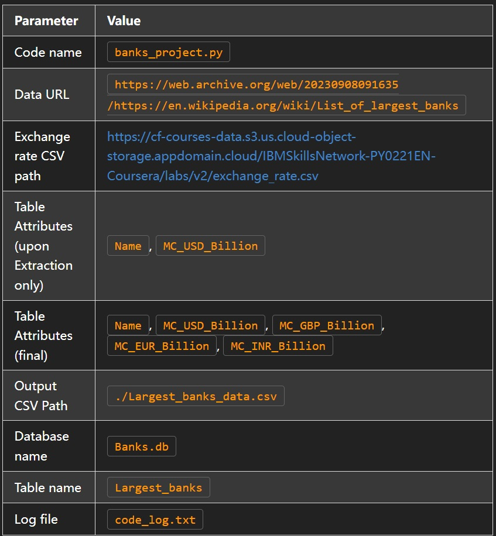

## Project Scenario

You have been hired as a data engineer by research organization. Your boss has asked you to create a code that can be used to compile the list of the top 10 largest banks in the world ranked by market capitalization in billion USD. Further, the data needs to be transformed and stored in GBP, EUR and INR as well, in accordance with the exchange rate information that has been made available to you as a CSV file. The processed information table is to be saved locally in a CSV format and as a database table.

Your job is to create an automated system to generate this information so that the same can be executed in every financial quarter to prepare the report.

Particulars of the code to be made have been shared below.

## Directions

1. Write a function to extract the tabular information from the given URL under the heading By Market Capitalization, and save it to a data frame.
2. Write a function to transform the data frame by adding columns for Market Capitalization in GBP, EUR, and INR, rounded to 2 decimal places, based on the exchange rate information shared as a CSV file.
3. Write a function to load the transformed data frame to an output CSV file.
4. Write a function to load the transformed data frame to an SQL database server as a table.
5. Write a function to run queries on the database table.
6. Run the following queries on the database table:
     a. Extract the information for the London office, that is Name and MC_GBP_Billion
     b. Extract the information for the Berlin office, that is Name and MC_EUR_Billion
     c. Extract the information for New Delhi office, that is Name and MC_INR_Billion
7. Write a function to log the progress of the code.
8. While executing the data initialization commands and function calls, maintain appropriate log entries.

## Project tasks

Task 1:
Write a function log_progress() to log the progress of the code at different stages in a file code_log.txt. Use the list of log points provided to create log entries as every stage of the code.

Task 2:
Extract the tabular information from the given URL under the heading 'By market capitalization' and save it to a dataframe.
 a. Inspect the webpage and identify the position and pattern of the tabular information in the HTML code
 b. Write the code for a function extract() to perform the required data extraction.
 c. Execute a function call to extract() to verify the output.

Task 3:
Transform the dataframe by adding columns for Market Capitalization in GBP, EUR and INR, rounded to 2 decimal places, based on the exchange rate information shared as  a CSV file.
 a. Write the code for a function transform() to perform the said task.
 b. Execute a function call to transform() and verify the output.

Task 4:
Load the transformed dataframe to an output CSV file. Write a function load_to_csv(), execute a function call and verify the output.

Task 5:
Load the transformed dataframe to an SQL database server as a table. Write a function load_to_db(), execute a function call and verify the output.

Task 6:
Run queries on the database table. Write a function load_from_db(), execute a given set of queries and verify the output.

Task 7:
Verify that the log entries have been completed at all stages by checking the contents of the file code_log.txt.